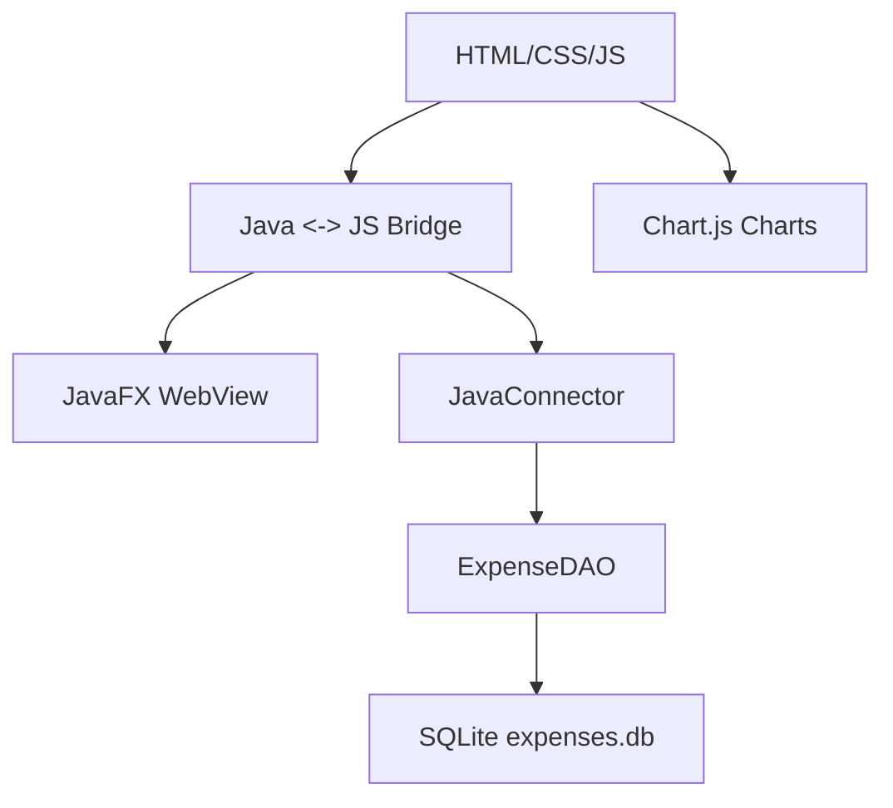

**Expense Tracker – JavaFX Desktop App**
A production-ready desktop expense tracker built with JavaFX WebView, HTML/CSS/JavaScript frontend, Java backend, and SQLite database. Features Java ↔ JavaScript bridge, interactive pie charts, dark mode, and CSV export.

📱**Demo**
Add expenses → 🗃️ SQLite saves → 📊 Charts update → 💾 CSV export
Click month → See category pie chart → Edit/Delete → Data persists!

✨ **Features**
✅ Add/Edit/Delete expenses with validation

✅ Month-wise categorization with totals

✅ Interactive pie charts (Chart.js)

✅ Dark/Light mode toggle

✅ CSV export for financial records

✅ SQLite persistence + localStorage backup

✅ Java ↔ JavaScript bridge (seamless sync)

✅ Responsive UI (1200x800 desktop)

## 🛠 Tech Stack
- **Frontend:**  HTML5 + CSS3 + ES6 + Chart.js
- **Backend:**  Java 24 + JavaFX 24 WebView
- **Database:**  SQLite (expenses.db)
- **Bridge:**  JavaConnector (JSObject)
- **Build:** javac/java (Maven-free)

📁 **Project Structure**
```text
expensetracker/
├── src/
│   ├── index.html          # Main UI
│   ├── style.css           # Dark/Light themes
│   ├── script.js           # Frontend logic + bridge
│   ├── ExpenseTrackerApp.java     # JavaFX WebView
│   ├── JavaConnector.java  # JS ↔ Java bridge
│   ├── ExpenseDAO.java     # SQLite CRUD
│   ├── Expense.java        # Data model
│   └── CSVExporter.java    # CSV generation
├── sqlite-jdbc.jar         # Database driver
├── slf4j-*.jar             # Logging
└── expenses.db             # SQLite data (auto-created)
```

**Compile & Run**
**Compile**
```cmd
"C:\Program Files\Java\jdk-24\bin\javac" ^
src\*.java
```

**Run**
```cmd
 "C:\Program Files\Java\jdk-24\bin\java" ^
-cp "src\;sqlite-jdbc.jar;slf4j-api-2.0.13.jar;slf4j-simple-2.0.13.jar" ^
ExpenseTrackerApp
```


**Architecture**


**Key Tehnical Highlights**:

1.**Java<->JavaScipt Bridge**:
// JavaFX WebView -> Inject JavaConnector
```java
JSObject window = (JSObject) webEngine.executeScript("window");
window.setMember("javaConnector", connector);
```

2.**SQLite DAO Pattern**:
```java
public class ExpenseDAO {
    public void addExpense(Expense expense) { /* SQLite INSERT */ }
    public List<Expense> getAllExpenses() { /* SQLite SELECT */ }
}
```

3.**Fallback Mechanism**:
// Works with Java OR localStorage
```javascript
if (typeof this.addExpenseReal === 'function') {
    this.addExpenseReal(...);  // SQLite
} else {
    localStorage.setItem(...); // Fallback
}
```

**Skills Demonstrated**
✅ Full-stack development (Java + Web)
✅ Desktop application architecture
✅ Database design (SQLite + JDBC)
✅ JavaFX WebView integration
✅ JavaScript bridge communication
✅ Responsive UI/UX design
✅ Data visualization (Chart.js)
✅ Production deployment


🚀 **Future Enhancements**
JAR packaging + auto-launcher
Maven/Gradle build system
JUnit tests for DAO layer
Multi-currency support
PDF export + charts
Cloud sync (Firebase)


👨‍💻 **Author**  
Mayank Purswani

    


